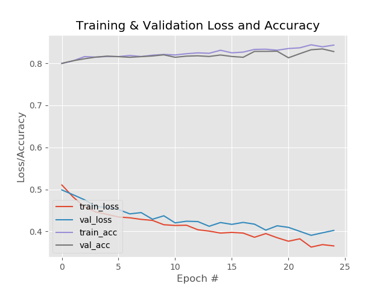

# A Keras Model (similar to LeNet-5) for Classification of Images.

**For Multi-label (One image belong to several classes) Classifications:**


- Use `sigmoid` for activation of your output layer. (Don't use `softmax`.) **Why:** In softmax when increasing score for one label, all others are lowered (it's a probability distribution). You don't want that when you have multiple labels. 

- For Single-label: use `softmax`.

If there's two opposite classes: for example "HAPPY" & "SAD" we should use `softmax`.
- Use `binary_crossentropy` for loss function.
- Use `predict` for evaluation.

## DEMO : `Demo_multilabel.ipynb`

## Code:

Consist of 3 python scripts:

- `model_build.py` (building a linear model with 4 convolution blocks.)
- `train_network.py`
- `classify.py`

#### Input Images for training:

- `data/train/bad_angry`
- `data/train/bad_boring`
- `data/train/bad_gloomy`
- `data/train/good_cheerful`
- `data/train/good_exciting`


Each category should be in each folder. Training data should be splited to 75% training data and 25% validation data. Use `make_train_val_data.py` to do this.

Validiation data should be in folders:

- `data/val/bad_angry`
- `data/val/bad_boring`
- `data/val/bad_gloomy`
- `data/val/good_cheerful`
- `data/val/good_exciting`


#### Requirements:
```
tensorflow_gpu==1.4.0
Keras==2.1.2
imutils==0.4.5
matplotlib==2.0.2
numpy==1.14.1
scikit_learn==0.19.1
tensorflow==1.7.0
```

#### Model, Labels and the Plot showing Training-Progress are Saved to:

the current working directory, or the path can be defined in the command line options.




#### Command line options to Run the code:

**To Train:** `python train_network.py --train_data data/train --val_data data/val --model multi-label.model`

**To Classify:** `python classify.py --model multi-label.model --image_path examples/sleeping.jpeg`

### Results:

```
examples\beach.jpeg
========================
```


```
bad_angry: 0.07%
bad_boring: 0.93%
bad_gloomy: 0.14%
good_cheerful: 2.38%
good_exciting: 97.89%
```


